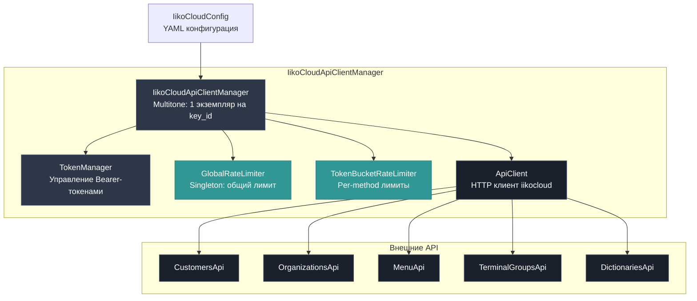
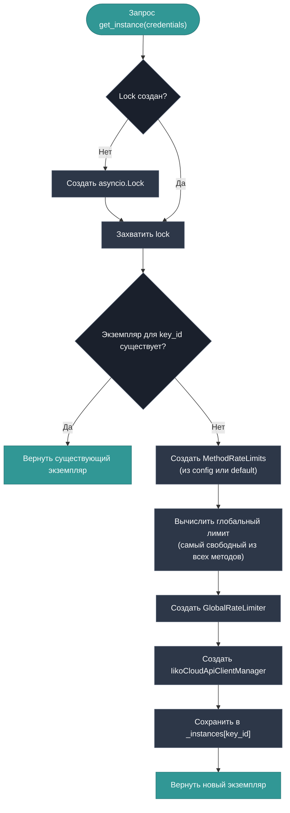
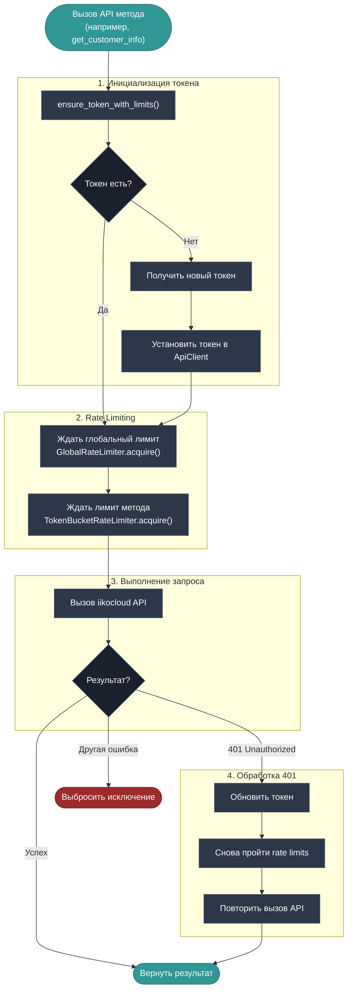
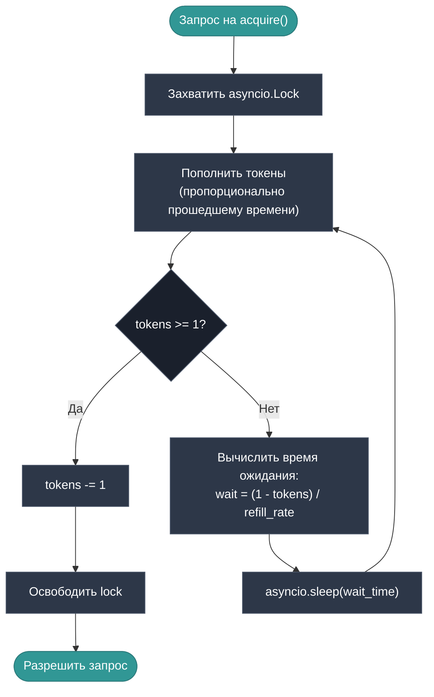

# IikoCloudApiClientManager — Архитектура и поток запросов

## Описание

`IikoCloudApiClientManager` — это фасад для работы с iikocloud API, реализующий:
- **Multitone паттерн** — один экземпляр на каждый `key_id`
- **Автоматическое управление токенами** — получение и обновление Bearer-токенов
- **Per-method rate limiting** — ограничение частоты запросов по каждому методу API
- **Глобальный rate limiting** — общее ограничение всех запросов
- **Retry при 401** — автоматическое обновление токена при истечении

---

## Компоненты системы



---

## Инициализация менеджера

При первом использовании менеджер создаётся через `get_instance()` или `from_config()`:



---

## Основной поток выполнения запроса

Каждый вызов API-метода проходит через `execute_with_retry()`:



---

## Rate Limiting: Token Bucket алгоритм

Каждый метод API имеет собственный rate limiter с конфигурируемыми параметрами:



### Формула пополнения токенов

```
tokens_to_add = elapsed_time × (max_requests / time_window_seconds)
tokens = min(max_tokens, tokens + tokens_to_add)
```

---

## Управление токенами (TokenManager)

`TokenManager` обеспечивает потокобезопасное получение и обновление Bearer-токенов:

```mermaid
flowchart TD
    subgraph "ensure_token_with_limits()"
        E_START(["Запрос токена"])
        E_CHECK{"token != None?"}
        E_RETURN(["Использовать существующий"])
        E_LOCK["Захватить lock"]
        E_DOUBLE_CHECK{"token != None?<br/>(double-check)"}
        E_CLEAR_EVENT["refresh_event.clear()"]
        E_FETCH["Запросить токен от API"]
        E_SET["Установить токен в ApiClient"]
        E_SET_EVENT["refresh_event.set()"]
        
        E_START --> E_CHECK
        E_CHECK -->|Да| E_RETURN
        E_CHECK -->|Нет| E_LOCK
        E_LOCK --> E_DOUBLE_CHECK
        E_DOUBLE_CHECK -->|Да| E_RETURN
        E_DOUBLE_CHECK -->|Нет| E_CLEAR_EVENT
        E_CLEAR_EVENT --> E_FETCH
        E_FETCH --> E_SET
        E_SET --> E_SET_EVENT
        E_SET_EVENT --> E_RETURN
    end

    subgraph "refresh_token_if_401_with_limits()"
        R_START(["Получена 401 ошибка"])
        R_IS_401{"Это 401?"}
        R_FALSE(["return False"])
        R_CHECK_EVENT{"refresh_event.is_set()?"}
        R_WAIT["Ждать refresh_event"]
        R_TRUE(["return True"])
        R_LOCK["Захватить lock"]
        R_VERSION_CHECK{"version изменилась?"}
        R_CLEAR["refresh_event.clear()"]
        R_FETCH["Запросить новый токен"]
        R_UPDATE["Обновить token и version"]
        R_SET_EVENT["refresh_event.set()"]
        
        R_START --> R_IS_401
        R_IS_401 -->|Нет| R_FALSE
        R_IS_401 -->|Да| R_CHECK_EVENT
        R_CHECK_EVENT -->|Нет| R_WAIT
        R_WAIT --> R_TRUE
        R_CHECK_EVENT -->|Да| R_LOCK
        R_LOCK --> R_VERSION_CHECK
        R_VERSION_CHECK -->|Да| R_TRUE
        R_VERSION_CHECK -->|Нет| R_CLEAR
        R_CLEAR --> R_FETCH
        R_FETCH --> R_UPDATE
        R_UPDATE --> R_SET_EVENT
        R_SET_EVENT --> R_TRUE
    end

    classDef process fill:#2d3748,stroke:#4a5568,color:#fff
    classDef decision fill:#1a202c,stroke:#4a5568,color:#fff
    classDef terminator fill:#319795,stroke:#2c7a7b,color:#fff
    
    class E_START,E_RETURN,R_START,R_FALSE,R_TRUE terminator
    class E_CHECK,E_DOUBLE_CHECK,R_IS_401,R_CHECK_EVENT,R_VERSION_CHECK decision
```



### Механизм защиты от гонок

1. **Lock** — только одна корутина может обновлять токен
2. **Event** — другие корутины ждут `refresh_event` вместо повторных запросов
3. **Version** — проверка, не обновил ли кто-то токен пока мы ждали lock

---

## Лимиты по методам API

| Метод | max_requests | time_window | Описание |
|-------|-------------|-------------|----------|
| `auth` | 1 | 5 сек | Авторизация |
| `get_organizations` | 1 | 10 сек | Список организаций |
| `create_or_update_customer` | 100 | 60 сек | Создание/обновление клиента |
| `get_customer_info` | 100 | 60 сек | Информация о клиенте |
| `delete_customers` | 100 | 60 сек | Удаление клиентов |
| `restore_customers` | 100 | 60 сек | Восстановление клиентов |
| `get_terminal_groups` | 10 | 60 сек | Терминальные группы |
| `check_terminal_groups_alive` | 10 | 60 сек | Проверка доступности |
| `get_external_menus` | 1 | 1800 сек | Список внешних меню |
| `get_menu_by_id` | 5 | 60 сек | Меню по ID |
| `get_stop_lists` | 10 | 60 сек | Стоп-листы |
| `get_delivery_cancel_causes` | 1 | 60 сек | Причины отмены |
| `get_order_types` | 1 | 60 сек | Типы заказов |
| `get_payment_types` | 1 | 60 сек | Типы платежей |
| `get_discounts` | 1 | 60 сек | Скидки |
| `get_removal_types` | 1 | 60 сек | Типы удаления |

> **Глобальный лимит** вычисляется автоматически как самый "свободный" из всех методов (максимальная скорость запросов).

---

## Пример использования

```python
import asyncio
from iikocloud import IikoCloudApiClientManager, get_iikocloud_config

async def main():
    # 1. Загрузить конфигурацию из YAML
    config = get_iikocloud_config()
    
    # 2. Создать менеджер (Multitone — повторный вызов вернёт тот же экземпляр)
    manager = await IikoCloudApiClientManager.from_config(config)
    
    try:
        # 3. Вызвать API-метод
        # Автоматически:
        #   - Получит токен (если нет)
        #   - Применит rate limiting
        #   - Обновит токен при 401
        orgs = await manager.organizations()
        print(orgs)
        
        # 4. Другой метод — те же гарантии
        customer = await manager.get_customer_by_phone(
            phone="+79001234567",
            organization_id="org-uuid-here"
        )
        print(customer)
        
    finally:
        # 5. Закрыть все соединения
        await IikoCloudApiClientManager.close_all()

asyncio.run(main())
```

---

## Обработка ошибок

| Код ответа | Поведение менеджера |
|------------|---------------------|
| **200** | Вернуть результат |
| **401** | Обновить токен и повторить запрос (1 раз) |
| **429** | Rate limit от iiko — можно проверить через `is_locked_because_of_iikocloud_rate_limit()` |
| **4xx/5xx** | Выбросить исключение (логируется) |

### Исключения

- `IikoCloudAuthException` — ошибка авторизации (некорректный API-ключ)
- `ApiException` — ошибки API iikocloud
- `UnauthorizedException` — 401 ошибка (обрабатывается автоматически)

---

## Закрытие соединений

При завершении работы **обязательно** вызвать:

```python
await IikoCloudApiClientManager.close_all()
```

Это:
1. Закроет все HTTP-соединения
2. Сбросит все экземпляры менеджеров
3. Сбросит `GlobalRateLimiter`
4. Очистит `TokenManager`
