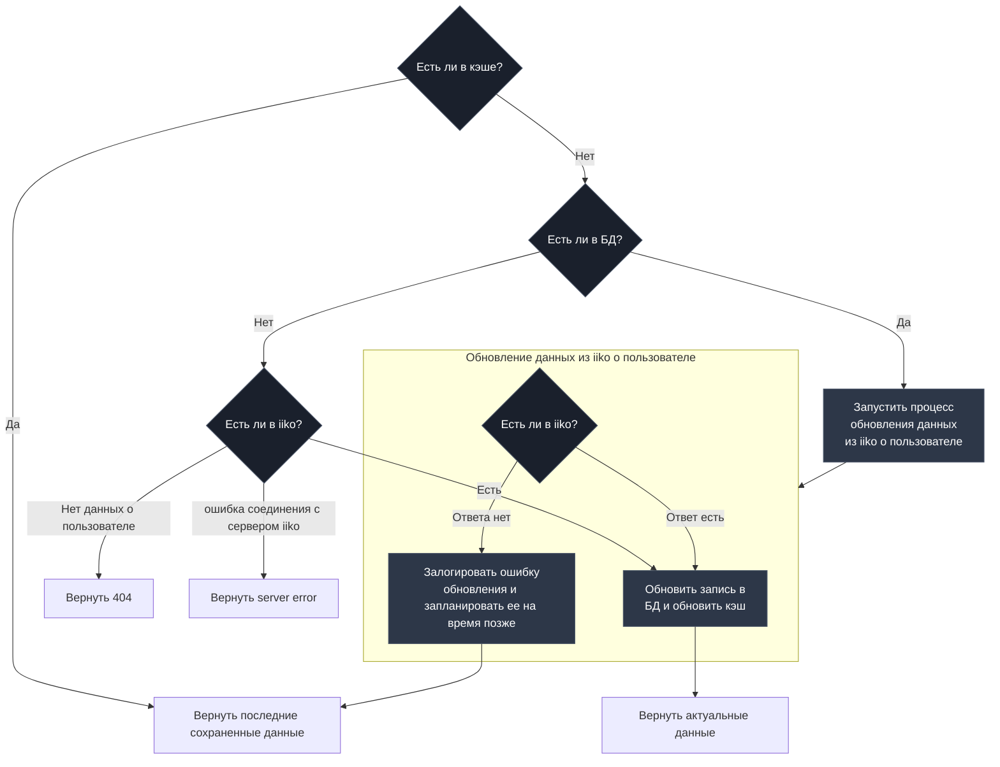

# Процесс получения пользователя по номеру телефона

## Описание

Данная диаграмма описывает алгоритм поведения апи при запросе пользователя по phone или id.

## Основной поток

/users/by/id?{userId}
/users/by/phone?{userPhone}


Success
```json
{
    "id": "",
    "name": "",
    "last_name":"",
    "middle_name": "",
    "tg_id": "",
    "email": "",
    "birthday": "",
    "comment": "",
    "consentStatus": "",
    "cardIds": "",
    "categoryIds": "",
    "walletIds": "",
    "shouldReceivePromoActionsInfo": "",
    "consentId": "",
    "isDeleted": "",
    "whenRegistered": "",
    "lastProcessedOrderDate":"",
    "firstOrderDate":"",
    "lastVisitedOrganizationId":"",
    "registrationOrganizationId":""
}
```

