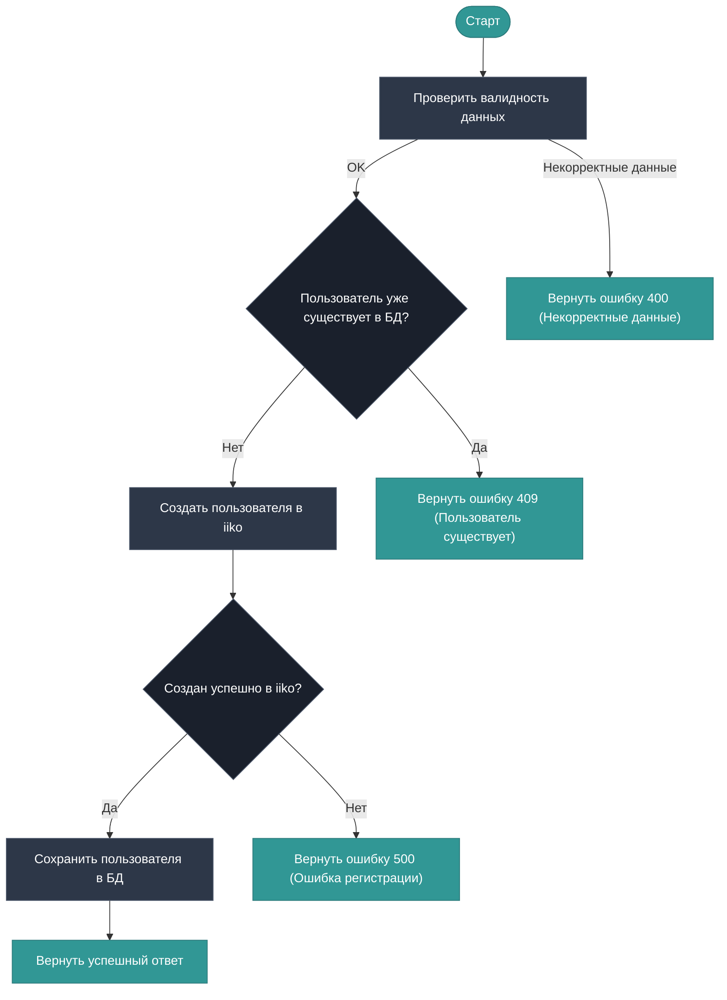

# Процесс регистрации пользователя

## Описание

Данная диаграмма описывает алгоритм регистрации нового пользователя по номеру телефона.

## Основной поток

POST /users/register



Успех
```json
{
    "id": "",
    "name": "",
    "last_name": "",
    "middle_name": "",
    "tg_id": "",
    "email": "",
    "birthday": "",
    "comment": "",
    "consentStatus": "",
    "cardIds": "",
    "categoryIds": "",
    "walletIds": "",
    "shouldReceivePromoActionsInfo": "",
    "consentId": "",
    "isDeleted": "",
    "whenRegistered": "",
    "lastProcessedOrderDate": "",
    "firstOrderDate": "",
    "lastVisitedOrganizationId": "",
    "registrationOrganizationId": ""
}
```

